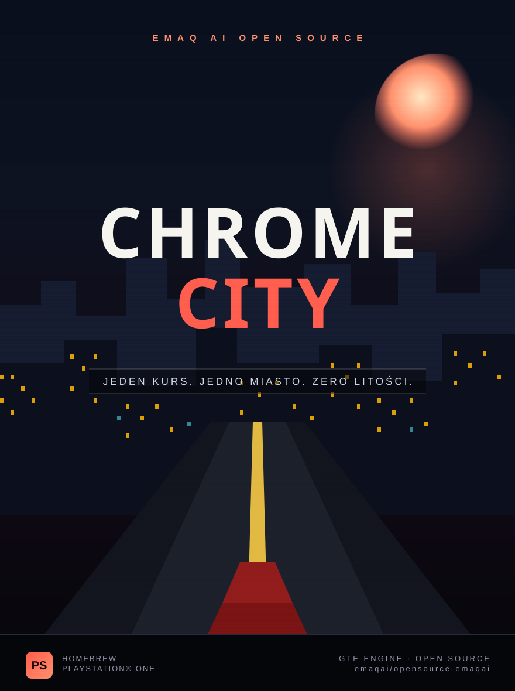

# Chrome City



An original open-world driving/crime game for the original Sony PlayStation
(PSX/PS1), in the spirit of *Grand Theft Auto III* but built from scratch as
real PS1 homebrew: procedurally generated city, drivable car with arcade
physics, AI traffic and pedestrians, a police "wanted level" system with
pursuing squad cars, and a short 3-mission story campaign with intro/ending
text screens, all rendered with the PS1 GPU/GTE (no PC/GTA code involved
anywhere).

It's written in C against [PSn00bSDK](https://github.com/Lameguy64/PSn00bSDK),
an open-source, from-scratch reimplementation of the PS1 SDK (MPL-2.0
licensed).

## Status / how this was verified

This was built and linked with the real PSn00bSDK 0.24 toolchain
(`mipsel-none-elf-gcc`, GCC 12.3.0, MIPS R3000 target) and produces a valid
PS-EXE (`chromecity.exe`, PC1=`0x800155c0`, load address `0x80010000`, the
standard PS1 user RAM base) and a bootable ISO (`chromecity.bin/.cue`) via
`mkpsxiso`. The build is warning-free at `-Wall -Wextra`. RAM usage is
~133 KB (text+data+bss), a small fraction of the console's 2 MB.

**It has also actually been run and played**, in [PCSX-Redux](https://github.com/grumpycoders/pcsx-redux)
built from source, booted through **OpenBIOS** (PCSX-Redux's MIT-licensed,
from-scratch BIOS reimplementation — no copyrighted Sony BIOS was used or
needed: with no retail BIOS configured, PCSX-Redux automatically falls back
to it). This confirmed, with real screenshots: the title/story text screens
render and advance correctly, the chase camera frames the car and follows
it through turns, accelerate/brake/steer/friction all behave as intended,
buildings/streets/lane markings render with correct perspective, AI traffic
cars drive their routes, and the HUD (speed/wanted stars/objective distance)
updates live. Testing this surfaced and fixed one real bug: colliding with
a traffic car could add "wanted" heat on every frame of continued contact
instead of once per collision, spiking the wanted level instantly (see
`HEAT_COOLDOWN` in `src/police.h`).

One known cosmetic glitch remains: a small stray-colored patch can flicker
in a screen corner from certain camera angles. It's a near-plane clipping
edge case — `src/clip.c` (adapted from PSn00bSDK's own example) only clips
in screen space, not against the camera's near plane, so geometry very
close to/behind the camera can occasionally project to a wrong on-screen
spot. The official PSn00bSDK examples have this same limitation; properly
fixing it means clipping polygons against the near plane before projection,
which is more involved and left as a follow-up.

If you own a PS1 (or a legally-dumped BIOS from one), you can of course
also drop it into your emulator's BIOS slot and load `chromecity.cue`, or
burn/ship the `.bin/.cue` to real hardware / an ODE (MODE, PicoStation,
etc.) — nothing here depends on OpenBIOS specifically.

## Building

You need [CMake](https://cmake.org/) >= 3.21 and PSn00bSDK's prebuilt
toolchain for Linux (or build it yourself — see PSn00bSDK's own docs).

```sh
# One-time setup: grab the prebuilt SDK+toolchain and put it on your PATH.
# (This project was built against PSn00bSDK 0.24.)
export PATH="/opt/psn00bsdk/bin:$PATH"
export PSN00BSDK_LIBS="/opt/psn00bsdk/lib/libpsn00b"

cmake --preset default .
cmake --build ./build
```

This produces, in `build/`:

- `chromecity.exe` — a raw PS-EXE, loadable directly by most emulators.
- `chromecity.bin` / `chromecity.cue` — a bootable CD image.

## Testing it yourself with PCSX-Redux + OpenBIOS

No BIOS file needed:

```sh
git clone --recurse-submodules https://github.com/grumpycoders/pcsx-redux.git
cd pcsx-redux
./dockermake.sh                       # builds bins/Release/pcsx-redux (needs Docker)
export PATH="/opt/psn00bsdk/bin:$PATH"
make -C src/mips/openbios -j4         # builds src/mips/openbios/openbios.bin

# From the pcsx-redux checkout root, so it finds src/mips/openbios/openbios.bin:
./pcsx-redux -run -loadexe /path/to/chromecity.exe
```

With no BIOS configured, PCSX-Redux logs `Retrying with the OpenBIOS` /
`OpenBIOS detected` and boots straight into it. `-loadexe` hijacks the BIOS
shell and jumps straight into the given PS-EXE — no CD image needed for
quick iteration.

## Controls

| Input                  | Action                              |
|-------------------------|--------------------------------------|
| D-Pad Up / Left stick up      | Accelerate                     |
| D-Pad Down / Left stick down  | Brake / reverse                |
| D-Pad Left/Right / stick      | Steer                          |
| Square                        | Handbrake (tighter, harder turn) |
| Cross / Start                 | Advance story/briefing text screens |

## What's actually implemented

- **Engine**: double-buffered GTE renderer (`src/render.c`), ordering-table
  depth sorting, screen-space quad clipping adapted from PSn00bSDK's own
  `fpscam` example (`src/clip.c`).
- **World** (`src/world.c`): a procedurally generated Manhattan-style street
  grid (5x5 blocks) with varied building heights, textured facades (concrete/
  brick/glass, randomly assigned per building) and painted lane lines, plus
  AABB collision for buildings.
- **Textures** (`src/texture.c`, `src/textures/*.tim`): 10 real PS1 textures
  drawn with `POLY_FT4` — 6 environment ones (road, sidewalk, 3 building
  facades, roof; 64x64 8bpp CLUT) plus 4 vehicle liveries (player stripe,
  taxi, police, fire brigade; 64x64 4bpp CLUT, since flat 4-5 color
  patterns don't need 256 colors). Road/sidewalk are procedural (so they
  tile seamlessly); the rest came from text prompts via a free image API,
  except the vehicle liveries, which turned out to need to be procedural
  too — an AI photo texture downscales to mush at 64x64 when it's a
  geometric pattern (stripe, checker) rather than an irregular material.
  See "Regenerating textures" below.
- **Vehicle physics** (`src/vehicle.c`): fixed-point accel/brake/steer/
  handbrake model shared by the player, traffic and police (same struct,
  different "driver").
- **Vehicle shapes** (`src/vehicle.c`): 3 body silhouettes, not just 3
  paint jobs on one box — `VSHAPE_SEDAN` (the original box), `VSHAPE_SUV`
  (taller, boxier, rides higher), `VSHAPE_SPORTS` (low cabin, fastback
  taper toward the tail, small spoiler). The fastback slopes toward the
  *tail*, not the nose: the camera always looks at the back of the car, so
  a sloped hood would never actually be seen. Police and fire-brigade cars
  additionally get a roof beacon bar ("kogut") — two small lit boxes,
  red+blue for police, red+red for fire — drawn as flat, untextured quads
  so they're unaffected by the vehicle's own livery texture.
- **Camera** (`src/camera.c`): a smoothed third-person chase camera.
- **Traffic AI** (`src/traffic.c`): cars looping fixed street routes
  (including a fire-brigade truck, red/white livery + lightbar, in the
  slot that used to be a plain flat red car), wandering-then-scattering
  pedestrians, both steered without a lookup table via a cross-product
  "steer toward point" trick (see `fixed.h`).
- **Police / wanted level** (`src/police.c`): 0-3 star wanted level, heat
  from hitting traffic/pedestrians, spawns pursuing squad cars (silver
  body, navy band, light-green reflective checker stripe, red/blue roof
  beacons), decays after enough time spent clear of them.
- **Story/mission state machine** (`src/mission.c`): title screen -> intro
  -> 3 missions (drive-to-contact, evade-the-cops-on-a-timer, cross-town
  delivery) each with a briefing/result text screen -> ending -> free roam.
- **HUD** (`src/hud.c`): speed, wanted stars, live objective distance /
  mission timer.

## Known simplifications (by design, not oversights)

- Only 4 vehicles have a real livery texture: the player's car (white
  racing stripe), the taxi-yellow traffic car, police cars, and the
  fire-brigade truck. The other 2 traffic colors stay flat-shaded — same
  `Vehicle.tex` mechanism, just no VRAM budget left for more without
  repacking the existing texture pages tighter.
- No true drift/slip physics — the handbrake tightens the turn radius and
  brakes hard, but the car's velocity always points along its heading.
- No memory card save. PSn00bSDK 0.24 doesn't ship a high-level card API
  and I didn't want to hand-roll unverified low-level card I/O; progress
  resets on power-off. The BIOS `card` functions in `psxapi.h` are the
  place to start if you want to add it.
- Missions can't be "failed", only completed faster or slower — this
  avoids needing a retry/game-over flow, keeping the loop always moving
  forward.

## Regenerating textures

The 6 in-game textures (`src/textures/*.tim`) are built from source images
in `tools/texture_src/`:

```sh
pip install Pillow
python3 tools/gen_procedural_textures.py tools/texture_src   # road + sidewalk
python3 tools/make_game_textures.py                          # crops/quantizes -> src/textures/*.tim
```

- `tex_road` / `tex_sidewalk` are generated procedurally (`tools/gen_procedural_textures.py`,
  toroidal value noise) so they tile perfectly edge-to-edge across many
  street quads — an AI image generator's idea of "seamless" reliably
  isn't, at this scale, so this is the one place procedural beat AI.
- The 3 wall variants and the roof were generated from text prompts via
  [pollinations.ai](https://pollinations.ai) (free, no API key) and then
  cropped/quantized to a 256-color palette by `tools/make_game_textures.py`.
  They're mapped once per wall (not tiled), so minor seams at the source
  image's edges never show.
- `tools/make_game_textures.py` also hand-writes each `.tim` file (PS1's
  native 8bpp-CLUT texture format) and picks its VRAM placement — see the
  comment at the top of that file for the layout and why it's safe
  relative to the framebuffers and debug font.
- `tools/make_car_textures.py` does the same for the 4 vehicle liveries in
  `tools/texture_src/{A_stripe,B_taxi,C_police,E_fire}.png` (4bpp instead
  of 8bpp; `D_muscle` is generated but not currently used by any vehicle —
  a free livery slot for a future car). Regenerate liveries with
  `python3 tools/gen_liveries.py` (in `tools/`, uses `PIL.ImageDraw` — flat
  geometric shapes, not a source photo) then `python3 tools/make_car_textures.py`.
- `tools/generate_cover.py` (below) is a separate, OpenAI-based path if you'd
  rather generate art through DALL-E instead of the free/procedural route.

## Cover art

`cover.svg` (rendered to `cover.png`) is the official cover art, built
procedurally (plain SVG shapes/gradients/text, no external image generator).

`tools/generate_cover.py` is an optional alternative: it calls OpenAI's
Images API to generate cover art from a text prompt, if you'd rather have
an AI-generated piece instead. It needs your own API key:

```sh
pip install openai
export OPENAI_API_KEY="sk-..."   # your own key — never commit it or paste it anywhere
python3 tools/generate_cover.py
```

## Tuning

Most of the "feel" constants live at the top of `src/vehicle.h`
(`VEH_MAX_SPEED`, `VEH_ACCEL`, `VEH_TURN_RATE`, ...), `src/camera.h`
(`CAM_DIST`, `CAM_HEIGHT`, `CAM_PITCH`) and `src/police.h`
(`EVADE_RADIUS`, `EVADE_TIME`). Once you can actually see it running,
those are the first things worth nudging.
